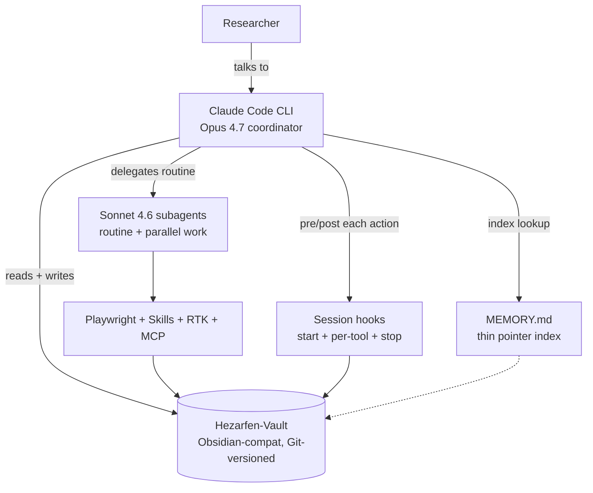

# Hezarfen-Vault Showcase

> An AI-native knowledge base for solo researchers — built on Claude Code with custom agents, skills, and session persistence.

This repository is a sanitized, public-facing showcase of [Hezarfen-Vault](https://github.com/TheGoatPsy) — a production knowledge base that a single researcher uses as their primary workspace for PhD research, clinical practice, software development, and 20+ parallel projects. The vault is the source of truth; AI agents read from it, write back to it, and persist decisions across sessions via atomic daily logs.

This showcase exposes the patterns, not the content.

---

## About

Hezarfen-Vault is a single-user, Obsidian-compatible knowledge base of 300+ markdown files that doubles as the memory layer for an AI coding agent (Claude Code). Every project, decision, client interaction, academic draft, and infrastructure change lives in one Git-versioned tree. The AI agent auto-loads the vault's canonical rules at session start, writes atomic updates back during work, and runs a structured closing ritual that commits the delta and leaves a handoff note for the next session.

The result is a workflow where:

- **Memory is a directory**, not a database or a vendor service.
- **Sessions are resumable**. Opening a new terminal recovers full context from the last log plus the previous handoff note.
- **Every work unit is traceable**. Files under `01-Gunluk/YYYY-MM-DD.md` log decisions, commits, and reference updates in chronological order.
- **Discipline is enforced by hooks**, not by memory. Session start, tool invocation, and session end each have pre/post hooks that validate vault state and auto-fix orphan links.

## Key Features

### Single-source-of-truth `CLAUDE.md`
A single canonical rules file (~300 lines, 13 sections) lives in the vault and is imported into `~/.claude/CLAUDE.md` and `~/CLAUDE.md` via `@`-reference. No drift between global config and project config. If the vault's `CLAUDE.md` moves, both importers update automatically.

### Session hooks (start → work → stop)
Three hook stages keep the vault clean without burning LLM tokens:

| Stage | What runs | What it produces |
|---|---|---|
| **Session start** | Template check, stale-lock detection, daily log open | A `YYYY-MM-DD.md` daily log ready for append |
| **After each tool call** | File-change tracker, orphan-link prevention | A running list of touched files |
| **Session stop** | 8-step closing ritual (deterministic Python, zero LLM tokens) | Commit + handoff note + vault health scan + next-session pointer |

### Auto-memory via thin pointer
A `MEMORY.md` file acts as a 1-line-per-entry index. Each feedback memory lives in its own file (`feedback_*.md`) with a structured format: **Why:** (the reason the rule exists) and **How to apply:** (when the rule kicks in). This separation keeps the index under 200 lines (the hard context budget) while letting individual memories grow.

### Custom skills library
200+ task-scoped skills covering academic writing, systematic reviews, citation management, clinical decision support, scientific slide decks, LaTeX posters, data analysis, mobile app scaffolding, and GSD-style project workflows. Skills are loaded on demand via the `Skill` tool rather than bloating the system prompt.

### Token-efficient shell (RTK)
All shell commands are prefixed with [`rtk`](https://github.com/rtk-ai/rtk) — a filter layer that compresses verbose tool output (test runners, build logs, git history, package managers) by 60–90%. A 10 000-line test failure becomes 30 lines of signal.

### Multi-model orchestration
Opus 4.7 (1M context) coordinates; Sonnet 4.6 (1M context) subagents run routine, parallelizable work (file migration, profile rendering, CV export, repo scaffolding). Coordinator stays small, workers stay cheap.

### Browser automation hierarchy
Three tools, strict priority: `WebFetch` → `PinchTab` → `Superpowers Chrome`. Cheapest-first, authenticated-sessions last. Other browser stacks (Playwright, Selenium) are deprecated to avoid pattern sprawl.

---

## Tech Stack

- **Claude Code CLI** — Opus 4.7 coordinator + Sonnet 4.6 1M subagents
- **Python 3.12** — session rituals, vault health checks, Playwright automation, RTK filters
- **Obsidian-compatible vault** — YAML frontmatter, `[[wikilinks]]`, MOC (Map of Content) navigation
- **Git-based versioning** — atomic daily commits via stop hook, no manual commit noise
- **MCP servers** — Context7 docs, Playwright browser, GitHub API, Bigdata.com research, Crypto.com market data

---

## Architecture

Every box on this diagram is a markdown directory or a deterministic script — no black-box services, no vector DB, no cloud memory. The whole thing runs on a laptop with a GitHub remote for backup.

---

## Example Session Flow

A typical research session, 2–4 hours, from the user's perspective:

1. **Open terminal** → CLI loads the vault's `CLAUDE.md` and `MEMORY.md`; daily log file opens automatically.
2. **Describe the task** → "Prepare the rebuttal section responding to Reviewer 2 on the systematic review manuscript."
3. **Agent enters plan mode** → writes a plan to a dedicated plan file (never in the chat), references existing vault notes, identifies the exact files that will change, and requests approval.
4. **User approves** → coordinator dispatches parallel Sonnet subagents: one pulls the reviewer comments, one drafts the response section, one verifies citations against the Zotero library, one updates the manuscript's change log.
5. **Coordinator reviews subagent outputs** → reconciles conflicts, produces the integrated rebuttal.
6. **Agent commits** → atomic git commit with a structured message; updates the daily log with timestamps per decision; appends to the project's active plan file.
7. **Session end** → stop hook runs: vault health scan, orphan link repair, git push, handoff note for the next session, closing summary of the three most impactful outputs.

The next session starts with the handoff note already loaded. Zero ramp-up.

---

## Examples

This repository ships three sanitized examples under `examples/` that show the structural patterns without exposing the researcher's actual work:

| File | Shows |
|---|---|
| [`examples/daily-log-template.md`](examples/daily-log-template.md) | The canonical shape of an atomic daily log file |
| [`examples/memory-feedback-example.md`](examples/memory-feedback-example.md) | How feedback memories are structured (rule, why, how-to-apply) |
| [`examples/moc-pattern.md`](examples/moc-pattern.md) | The Map of Content navigation pattern across domains |

These are starting points — the real vault has hundreds of files built on the same three primitives.

---

## Demo

A 3-minute Loom walkthrough of the live vault is in production. It will link from this section when ready.

---

## Why publish this?

Most "AI coding agent" demos show toy codebases and greenfield projects. This showcase argues the opposite: the most valuable application of a capable AI assistant is **compounding context inside a living personal workspace**. The infrastructure to make that work — hooks, atomic logs, thin-pointer memory, skill libraries, model orchestration, browser automation hierarchy — is what separates a toy from a second brain.

If you are a solo researcher, clinician, writer, indie developer, or anyone whose work benefits from persistence across sessions, the patterns here are portable to any vault layout.

---

## License

[MIT](LICENSE). Examples and documentation in this repo are licensed permissively; patterns and architecture diagrams are offered for reuse in your own knowledge base.

---

## Contact

- ORCID: [0000-0003-1076-3928](https://orcid.org/0000-0003-1076-3928)
- GitHub: [@TheGoatPsy](https://github.com/TheGoatPsy)
- Book: *Üretken Yapay Zeka ve Ruh Sağlığı* (Generative AI and Mental Health), Nobel Akademik Yayıncılık

Open to consulting engagements for teams building AI-native internal tooling, especially in healthcare, mental health, and academic research contexts.
